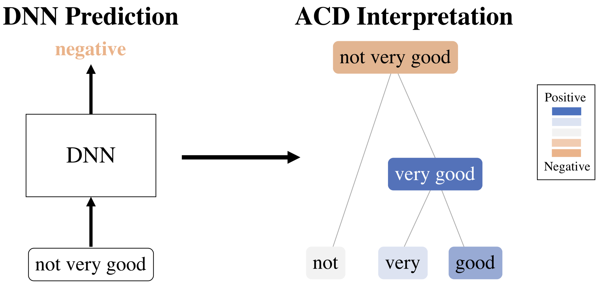

Modern machine learning (ML) models, particularly deep neural networks, are difficult to understand and explain. This has consequences when these networks are used to make critical decisions. Thus it is important to develop methods that can interpret these highly complex models. As ML models enter into high-stakes fields, interpretability will become increasingly important. 

Interpretable ML as a field is still fairly immature, with many still asking the basic question "what is interpretability?". [One recent work](https://arxiv.org/abs/1901.04592) from our group aims to address this problem and understand the current landscape of the field of interpretable ML.

## desiderata

The work introduces three desiderata a good interpretable ML pipeline should satisfy: **predictive accuracy**, **descriptive accuracy**, and **relevancy**. These are depicted in a typical data-science lifecycle below.

## methods

The work also categorizes existing methods into two main categories: **model-based interpretability** (i.e. the construction of models that readily provide insight into the relationships they have learned) and **post-hoc interpretability** (i.e. methods that analyze a trained model in order to provide insights into the learned relationships).

# some examples

Work from our lab has generated a number of methods, mostly focused on post-hoc interpretability: 

- [ACD](https://openreview.net/pdf?id=SkEqro0ctQ) is an algorithm for generating hierarchical interpretations of a single prediction made by a neural network. It is able to score interactions for arbitrary DNNs by extending the Contextual Decomposition score and then hierarchically aggregate them into a succinct visualization
  - 
- [CDEP](https://arxiv.org/abs/1909.13584) penalizes interpretations of a DNN during training in order to incoporate prior knowledge and improve the predictive accuracy of models
- [DAC](https://arxiv.org/abs/1905.07631) extracts interactions from a fully trained random forest and visualizes these importances in the form of a curve or a heatmap