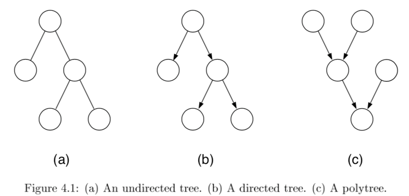
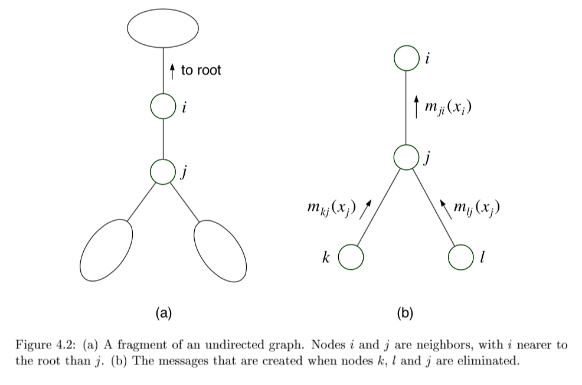
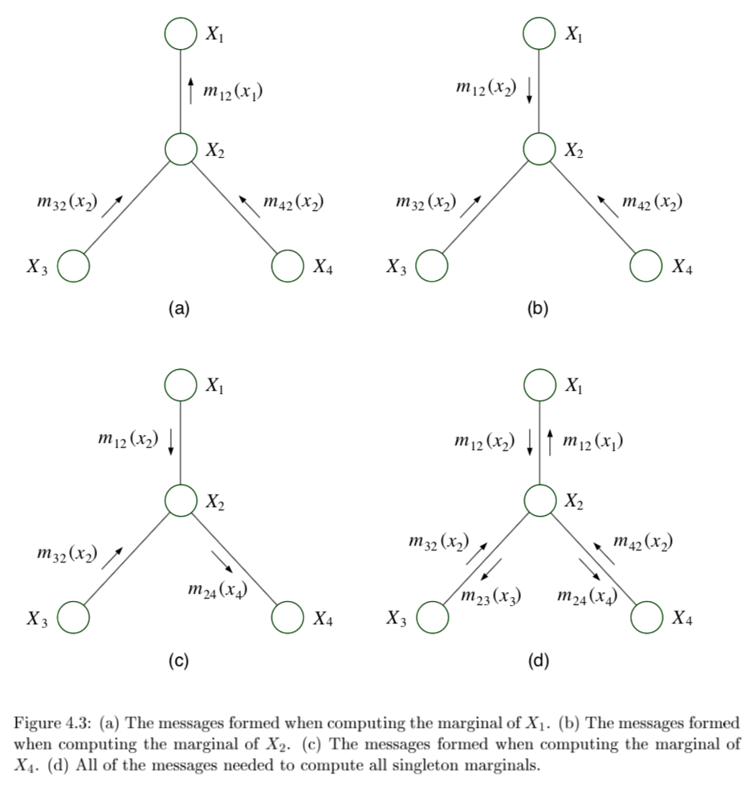
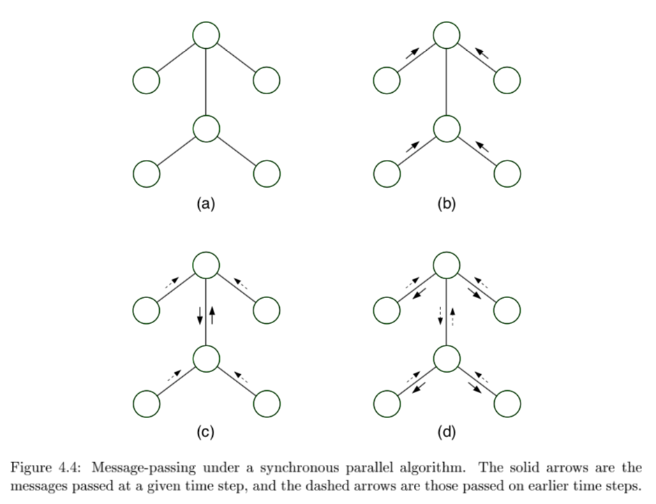
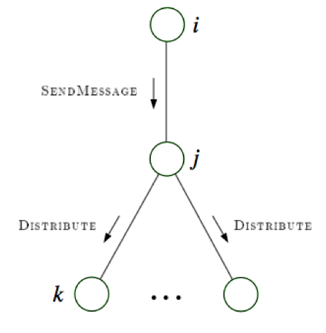
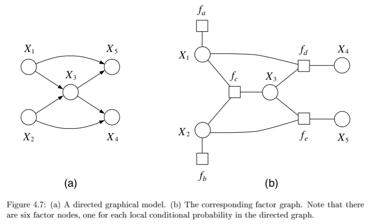

* TOC
{:toc}

*Material from Russell and Norvig "Artifical Intelligence" 3rd Edition* and *Jordan "Graphical Models"*

# overview

- network types
  1. *bayesian networks* - directed
  2. undirected models
- latent variable types
  1. *mixture models* - discrete latent variable
  2. *factor analysis models* - continuous latent variable
- graph representation: missing edges specify independence (converse is not true)
  - encode conditional independence relationships
    - helpful for inference
  - compact representation of joint prob. distr. over the variables

- dark is observed for HMMs, for other things unclear what it means

# bayesian networks - R & N 14.1-5 + J 2

- examples
   1. *causal model*: causes $\to$ symptoms
   2. *diagnostic model*: symptoms $\to$ causes
      - generally requires more dependencies
- learning
   1. expert-designed
   2. data-driven
- properties
  - each node is random variable
  - weights as tables of conditional probabilities for all possibilities
  - represented by directed acyclic graph
- joint distr: $P(X_1 = x_1,...X_n=x_n)=\prod_{i=1}^n P[X_i = x_i \vert  Parents(X_i)]$
  - *markov condition*: given parents, node is conditionally independent of its non-descendants
    - marginally, they can still be dependent (e.g. explaining away)
  - given its *markov blanket* (parents, children, and children's parents), a node is independent of all other nodes
- BN has no redundancy $\implies$ no chance for inconsistency

  - forming a BN: keep adding nodes, and only previous nodes are allowed to be parents of new nodes

## hybrid BN (both continuous & discrete vars)

- for continuous variables can sometimes discretize
1. *linear Gaussian* - for continuous children
  - parents all discrete $\implies$ *conditional Gaussian* - multivariate Gaussian given assignment to discrete variables
  - parents all continuous $\implies$ *multivariate Gaussian* over all the variables, and a multivariate posterior distribution (given any evidence)
  - parents some discrete, some continuous
    - h is continuous, s is discrete; a, b, $\sigma$ all change when s changes
    - $P(c|h,s) = N(a \cdot h + b, \sigma^2)$, so mean is linear function of h
2. discrete children (continuous parents)
  1. *probit distr* - $P(buys|Cost=c) = \phi[(\mu - c)/\sigma]$ - integral of standard normal distr
    - like a soft threshold
  2. *logit distr.* - $P(buys|Cost=c) =s\left(\frac{-2 (\mu - c)}\sigma \right)$
    - logistic function (sigmoid s) produces thresh

## exact inference

- given assignment to *evidence variables* E, find probs of *query variables* X
  - other variables are *hidden variables* H
1. *enumeration* - just try summing over all hidden variables
  - $P(X|e) = \alpha P(X, e) = \alpha \sum_h P(X, e, h)$
    - $\alpha$ can be calculated as $1 / \sum_x P(x, e)$
  - $O(n \cdot 2^n)$
    - one summation for each of *n* variables
  - ENUMERATION-ASK evaluates in depth-first order: $O(2^n)$
    - we removed the factor of *n*
2. *variable elimination* - dynamic programming **(see elimination)**
  - 
  - $P(B|j, m) = \alpha \underbrace{P(B)}_{f_1(B)} \sum_e \underbrace{P(e)}_{f_2(E)} \sum_a \underbrace{P(a|B,e)}_{f_3(A, B, E)} \underbrace{P(j|a)}_{f_4(A)} \underbrace{P(m|a)}_{f_5(A)}$
    - calculate factors in reverse order (bottom-up)
    - each factor is a vector with num entries = $\prod$ |num_elements| * |num_values| 
    - when we multiply them, pointwise products
  - ordering
    - any ordering works, some are more efficient
    - every variable that is not an ancestor of a query variable or evidence variable is irrelevant to the query
    - complexity depends on largest factor formed
3. *clustering algorithms* = *join tree* algorithms **(see propagation factor graphs)**
  - join individual nodes in such a way that resulting network is a polytree
    - 
    - *polytree*=*singly-connected network* - only 1 undirected paths between any 2 nodes
      - time and space complexity of exact inference is linear in the size of the network
      - holds even if the number of parents of each node is bounded by a constant
  - can compute posterior probabilities in $O(n)$
    - however, conditional probability tables may still be exponentially large

## approximate inferences in BNs

- randomized sampling algorithms = *monte carlo* algorithms
1. *direct sampling* methods:
  - *simplest* - sample network in topological order
  - *rejection sampling* - sample in order and stop once evidence is violated
    - want P(D|A)
    - sample N times, throw out samples where A is false
    - return probability of D being true
    - this is slow
  - *likelihood weighting* - fix evidence to be more efficient
    - generating a sample
      - fix our evidence variables to their observed values, then simulate the network
      - can't just fix variables - distr. might be inconsistent
      - calculate *W* = prob of sample being generated
        - when we get to an evidence variable, multiply by prob it appears given its parents
    - for each observation
      - if positive, Count = Count + *W*
      - Total = Total + *W*
    - return Count/Total
    - this way we don't have to throw out wrong samples
    - doesn't solve all problems - evidence only influences the choice of downstream variables

2. *Markov chain monte carlo* - ex. *Gibbs sampling*, *Metropolis-Hastings*
  - fix evidence variables
  - sample a nonevidence variable $X_i$ conditioned on the current values of its Markov blanket
  - repeatedly resample one-at-a-time in arbitrary order
  - why it works
    - the sampling process settles into a dynamic equilibrium where time spent in each state is proportional to its posterior probability
    - provided transition matrix q is *ergodic* - every state is reachable and there are no periodic cycles - only 1 steady-state soln
  - Gibbs: we have conditionals
    - Metropolis-Hastings we have to estimate conditionals

3. *variational inference* - formulate inference as optimization
   - minimize KL-divergence between observed samples and assumed distribution

## conditional independence properties

- multiple, competing explanations ("explaining-away")

   

  -  in fact any descendant of the base of the v suffices for explaining away

- *d-separation* = directed separation

- *Bayes ball algorithm* - is $( X_A \perp X_B )| X_C$?

  - initialize
    - shade $X_C$
    - place ball at each of $X_A$
    - if any ball reaches $X_B$, then not conditionally independent
  - rules
    - balls can't pass through shaded unless shaded is at base of v
    - balls pass through unshaded unless unshaded is at base of v

- 

# undirected

- $X_A \perp X_C | X_B$ if the set of nodes $X_B$ separates the nodes $X_A$ from $X_C$

  

- can't convert directed / undirected

- factor over *maximal cliques* (largest sets of fully connected nodes)
- potential function $\psi_{X_C} (x_C)$ function on possible realizations $x_C$ of the maximal clique $X_C$
  - non-negative, but not a probability (specifying conditional probs. doesn't work)
  - commonly let these be exponential: $\psi_{X_C} (x_C) = \exp(-f_C(x_C))$
    - yields energy $f(x) = \sum_C f_C(x_C)$
    - yields *Boltzmann distribution*: $p(x) = \frac{1}{Z} \exp (-f(x))$
- $p(x) = \frac{1}{Z} \prod_{C \in Cliques} \psi_{X_C}(x_c)$
  - $Z = \sum_x \prod_{C \in Cliques} \psi_{X_C} (x_C)$
- *reduced parameterizations* - impose constraints on probability distributions (e.g. Gaussian)
- if x is dependent on all its neighbors
  - *Ising model* - if x is binary
  - *Potts model* - x is multiclass

# elimination - J 3

- the elimination algorithm is for *probabilistic inference*
  - want $p(x_F|x_E)$ where E and F are disjoint
  - any var that is not ancestor of evidence or ancestor of query is irrelevant
- here, let $X_F$ be a single node
- notation
  - define $m_i (x_{S_i})$ = $\sum_{x_i}$ where $x_{S_i}$ are the variables, other than $x_i$, that appear in the summand
  - define *evidence potential* $\delta(x_i, \bar{x_i})$ is defined as $x_i == \bar{x_i}$
    - then $$g(\bar{x_i}) = \sum_{x_i} \delta (x_i, \bar{x_i})$$
    - for a set $\delta (x_E, \bar{x_E}) = \prod_{i \in E} \delta (x_i, \bar{x_i})$
    - lets us define $p(x, \bar{x}_E) = p^E(x) = p(x) \delta (x_E, \bar{x_E})$
  - undirected graphs
    - $\psi_i^E(x_i) \triangleq \psi_i(x_i) \delta(x_i, \bar{x}_i)$
    - this lets us write $p^E (x) = \frac{1}{Z} \prod_{c\in C} \psi^E_{X_c} (x_c)$
      - can ignore z since this is unnormalized anyway
      - to find conditional probability, divide by all sum of $p^E(x)$ for all values of E
    - in actuality don't compute the product, just take the correct slice
- eliminate algorithm
  1. initialize: choose an ordering with query last
  2. evidence: set evidence vars to their values
  3. update: loop over element $x_i$ in ordering
     1. let $\phi_i(x_{T_i})$ be product of all potentials involving $x_i$
     2. sum over the product of these potentials $m_i(x_{S_i}) = \sum_x \phi_i(x_{T_i})$
  4. normalize: $p(x_F|\bar{x}_E) = \phi_F(x_F) / \sum_{x_F} \phi_F (x_F)$
- undirected graph elimination algorithm
  - for directed graph, first *moralize*
    - for each node connect its parents
    - drop edges orientation
  - for each node X
    - connect all remaining neighbors of X
    - remove X from graph
- *reconstituted graph* - same nodes, includes all edges that were added
  - *elimination cliques* - includes X and its neighbors when X is removed
  - computational complexity is the exponential in the number of variables in the elimination clique
  - involves *treewidth* - one less than smallest achievable value of cardinality of largest elimination clique
    - range over all possible elimination orderings
    - NP-hard to find elimination ordering that achieves the treewidth

# propagation factor graphs - J 4

- *tree* - undirected graph in which there is exactly one path between any pair of nodes
   - if directed, then moralized graph should be a tree
   - *polytree* - directed graph that reduces to an undirected tree if we convert each directed edge to an undirected edge
   - 
   - $$p(x) = \frac{1}{Z} \left[ \prod_{i \in V} \psi (x_i) \prod_{(i,j)\in E} \psi (x_i,x_j) \right]$$
      - for directed, root has individual prob and others are conditionals
    - can once again use evidence potentials for conditioning

## probabilistic inference on trees

- eliminate algorithm through message-passing
   - ordering I should be **depth-first traversal** of tree with f as root and all edges pointing away
      - *message* $m_{ji}(x_i)$ from $j$ to $i$ =*intermediate factor*

- 2 key equations

    - $m_{ji}(x_i) = \sum_{x_j} \left( \psi^E (x_j) \psi (x_i, x_j) \prod_{k \in N(j) \backslash i} m_{kj} (x_j) \right)$
    - $p(x_f | \bar{x}_E) \propto \psi^E (x_f) \prod_{e \in N(f)} m_{ef} (x_f) $
       - 

- **sum-product** = **belief propagation** - inference algorithm
  - computes all single-node marginals (for certain classes of graphs) rather than only a single marginal

  - only works in trees or tree-like graphs

  - 

    

  - *message-passing protocol* - a node can send a message to a neighboring node when, and only when, it has received messages from all of its other neighbors (parallel algorithm)
    1. evidence(E)
    2. choose root
    3. collect: send messages evidence to root
    4. distribute: send messages root back out

     

## factor graphs

- *factor graphs* capture factorizations, not conditional independence statements 
   - ex $\psi (x_1, x_2, x_3) = f_a(x_1,x_2) f_b(x_2,x_3) f_c (x_1,x_3)$ factors but has no conditional independence
       - 
    - $$f(x_1,...,x_n) = \prod_s f_s (x_{C_s})$$
    - neighborhood N(s) for a factor index s is all the variables the factor references
    - neighborhood N(i) for a node i is set of factors that reference $x_i$
    - provide more fine-grained representation of prob. distr.
       - could add more nodes to normal graphical model to do this
 - *factor tree* - if factors are made nodes, resulting undirected graph is tree
    - two kinds of messages (variable-> factor & factor-> variable)
    - run all the factor $\to$ variables first
     - 
     - $$p(x_i) \propto \prod_{s \in N(i)} \mu_{si} (x_i)$$
     - if a graph is originally a tree, there is little to be gained from factor graph framework
        - sometimes factor graph is factor tree, but original graph is not

## maximum a posteriori (MAP)

- want $\max_{x_F} p(x_F | \bar{x}_E)$ 	
- MAP-eliminate algorithm is very similar to before
  - initialize - choose ordering
  - evidence - set evidence
  - update - for each take max over variable and make new factor
  - maximum - marginalize

 - products of probs tend to underflow, so take $\max_x \log p^E (x)$
 - can also derive a *max-product algorithm* for trees

 1. find $\text{argmax}_x p^E (x)$
    - can solve by keeping track of maximizing values of variables in max-product algorithm

# dynamic bayesian nets

- *dynamic bayesian nets* - represents a temporal prob. model

## state space model

- state space model 

- $P(X_{0:t}, E_{1:t}) = P(X_0) \prod_{i} \underbrace{P(X_i | X_{i-1}) }_{\text{transition model}}  \: \underbrace{P(E_i|X_i)}_{\text{sensor model}}$

  - agent maintains *belief state* of state variables $X_t$ given evidence variables $E_t$

  - improve accuracy
    1. increase order of Markov transition model
    2. increase set of state variables (can be equivalent to 1)
    - hard to maintain state variables over time, want more sensors

- 4 inference problems (here $\cdot$ is elementwise multiplication)

  1. *filtering* = *state estimation* - compute $P(X_t | e_{1:t})$
    - *recursive estimation*:  $$\underbrace{P(X_{t+1}|e_{1:t+1})}_{\text{new state}} = \alpha \: \underbrace{P(e_{t+1}|X_{t+1})}_{\text{sensor}} \cdot \underset{x_t}{\sum} \: \underbrace{P(X_{t+1}|x_t)}_{\text{transition}} \cdot \underbrace{P(x_t|e_{1:t})}_{\text{old state}}$$ where $\alpha$ normalizes probs

  2. *prediction* - compute $P(X_{t+k}|e_{1:t})$ for $k>0$
- $\underbrace{P(X_{t+k+1} |e_{1:t})}_{\text{new state}} = \sum_{x_{t+k}} \underbrace{P(X_{t+k+1} |x_{t+k})}_{\text{transition}}  \cdot \underbrace{P(x_{t+k} |e_{1:t})}_{\text{old state}}$
     
3. *smoothing* - compute $P(X_{k}|e_{1:t})$ for $0 < k < t$
     1. 2 components $P(X_k|e_{1:t}) = \alpha \underbrace{P(X_k|e_{1:k})}_{\text{forward}} \cdot \underbrace{P(e_{k+1:t}|X_k)}_{\text{backward}}$
  
     1. forward pass: filtering from $1:t$
       2. backward pass from $t:1$ $\underbrace{P(e_{k+1:t}|X_k)}_{\text{sensor past k}} = \sum_{x_{k+1}} \underbrace{P(e_{k+1}|x_{k+1})}_{\text{sensor}} \cdot \underbrace{P(e_{k+2:t}|x_{k+1})}_{\text{recursive call}} \cdot \underbrace{P(x_{k+1}|X_k)}_{\text{transition}}$
       3. this is called the forward-backward algo(also there is a separate algorithm that doesn't use the observations on the backward pass)
  
4. *most likely explanation* - $\underset{x_{1:t}}{\text{argmax}}\:P(x_{1:t}|e_{1:t})$
  
   1. *Viterbi algorithm*: $\underbrace{\underset{x_{1:t}}{\text{max}} \: P(x_{1:t}, X_{t+1}|e_{1:t+1})}_{\text{mle x}} = \alpha \: \underbrace{P(e_{t+1}|X_{t+1})}_{\text{sensor}} \cdot \underset{x_t}{\text{max}} \left[ \: \underbrace{P(X_{t+1}|x_t)}_{\text{transition}} \cdot \underbrace{\underset{x_{1:t-1}}{\text{max}} \:P(x_{1:t-1}, x_{t+1}|e_{1:t})}_{\text{max prev state}} \right]$
     2. complexity
        - K = number of states
        - M = number of observations
        - n = length of sequence
        - memory - $nK$
        - runtime - $O(nK^2)$
  
- *learning* - form of EM

  - basically just count (maximizing joint likelihood of input and output)
  - initial state probs $\frac{count(start \to s)}{n}$
  - $P(x'|x) = \frac{count(s \to s')}{count(s)}$
  - $P(y|x) = \frac{count (x \to y)}{count(x)}$

## hmm

- **state is a single discrete process**
- transitions are all matrices (and no zeros in sensor model)$\implies$ forward pass is invertible so can use constant space
- ***online smoothing (with lag)***
- ex. robot localization

## kalman filtering

- **state is continuous**
- ex. 
- type of nodes (real-valued vectors) and prob model (linear-Gaussian) changes from HMM
- 1d example: *random walk*
- state nodes: $x_{t+1} = Ax_t + Gw_t$

- output nodes: $y_t = Cx_t+v_t$
  - x is linear Gaussian
  - w is noise Gaussian
  - y is linear Gaussian
- doing the integral for prediction involves completing the square
- properties
  1. new mean is weighted mean of new observation and old mean
  2. update rule for variance is independent of the observation
  3. variance converges quickly to fixed value that depends only on $\sigma^2_x, \sigma^2_z$
- **Lyapunov eqn**: evolution of variance of states
- **information filter** - mathematically the same but different parameterization
- *extended Kalman filter*
  - works on nonlinear systems
  - locally linear
- *switching Kalman filter* - multiple Kalman filters run in parallel and weighted sum of predictions is used 
  - ex. one for straight flight, one for sharp left turns, one for sharp right turns
  - equivalent to adding discrete "maneuver" state variable

## general dbns

- can be better to decompose state variable into multiple vars
  - reduces size of transition matrix
- *transient failure model* - allows probability of sensor giving wrong value
- *persistent failure model* - additional variable describing status of battery meter
- exact inference - *våariable elimination* mimics recursive filtering
  - still difficult
- approximate inference - modification of likelihood weighting
  - use samples as approximate representation of current state distr.
  - ***particle filtering*** - focus set of samples on high-prob regions of the state space
    - consistent
    - sample a state
    - sample the next state given the previous state
    - weight each sample by $P(e_t | x_t)$
    - resample based on weight

# structure learning

- conditional correlation - inverse covariance matrix = precision matrix
    - estimates only good when $n >> p$
    - eigenvalues are not well-approximated
    - often enforce sparsity
    - ex. threshold each value in the cov matrix (set to 0 unless greater than thresh) - this threshold can depend on different things
    - can also use regularization to enforce sparsity
    - POET doesn't assume sparsity